# Lab 1: Estimating Truck Cargo Space with AI

No programming experience required. You will follow copy-paste steps in a
terminal, edit one plain-text settings file, and label some photos by eye.
That's it — the AI code itself is already written for you.

## What you'll learn

- Why AI needs "labeled" examples before it can learn anything
- That your labeling choices directly change how good the AI becomes
- How changing a few settings (no programming) changes a model's accuracy
- How to read a simple accuracy score and compare it with classmates

## The big picture

We have photos taken by two cameras bolted inside a delivery truck's cargo
box (one near the front, one near the rear). As the truck gets loaded during
the day, the pile of boxes grows. Your goal: build an AI model that looks at
a new photo and guesses **what percentage of the cargo space is used** (0% =
empty, 100% = completely full).

Nobody has ever written down the "correct" fill percentage for these photos
— there's no automatic way to measure it. So before any AI can learn, a
*human* has to look at each photo and estimate it. That's your job in Part 1.
This is normal in real AI projects: most of the effort goes into preparing
good data, not writing code.

## What's already done for you

- 42 photos (21 front-camera + 21 rear-camera) have been organized into
  `datasets/processed/images/`.
- A spreadsheet-like file, `datasets/processed/manifest.csv`, lists every
  photo with an empty column waiting for your label.
- All the AI code — feature extraction, model training, scoring, plotting —
  is already written in `scripts/`. You will only *run* it, never edit it.
- The only file you'll edit is `configs/cargo_config.yaml`, a plain-text
  settings file (not code).

## How it all fits together

```mermaid
flowchart LR
    raw["Raw truck photos"]:::done --> organize["Organize photos<br/>organize_dataset.py"]:::done
    organize --> label["Label<br/>fill_level"]:::action
    label --> split["Split train/val/test<br/>make_splits.py"]:::done
    split --> config["Edit<br/>cargo_config.yaml"]:::action
    config --> train["Train model<br/>cargo_train.py"]:::done
    train --> evaluate["Evaluate model<br/>cargo_evaluate.py"]:::done
    evaluate --> score["Your score:<br/>Mean Absolute Error"]:::score
    score -. "try different settings (Part 5)" .-> config

    classDef done fill:#F3F4F6,stroke:#4B5563
    classDef action fill:#FDF1E7,stroke:#B54708
    classDef score fill:#EAF1FB,stroke:#1F5FA8
```



Gray = already done for you, orange = you do this, blue = your score. The
top row happens once (organize the photos, then label them). The bottom row
is the part you'll repeat over and over in Part 5, trying to get the lowest
possible score.

## Part 0: One-time setup

Open a terminal (on Mac: the **Terminal** app; on Windows: **Anaconda
Prompt** or **PowerShell**) and run these commands one at a time. Copy each
line exactly, press Enter, and wait for it to finish before the next one.

```bash
cd AI-training
python3 -m venv .venv
source .venv/bin/activate      # Windows: .venv\Scripts\activate
pip install -r requirements.txt
```

If that last command finishes without red error text, you're ready. You
only need to do Part 0 once (but you must run the `source .venv/bin/activate`
line again every time you open a new terminal window).

## Part 1: Label the photos (this is the main task)

1. Open `datasets/processed/manifest.csv` in Excel, Numbers, or Google
   Sheets.
2. For each row, open the photo it points to (the `filepath` column, inside
   `datasets/processed/`) and decide how full the truck looks, using this
   scale:

   | Word you type in `fill_level` | Meaning |
   |---|---|
   | `empty`  | Floor is fully visible, little to no cargo |
   | `low`    | Some boxes/bags, most of the floor still visible |
   | `medium` | Cargo covers roughly half the floor / waist-height pile |
   | `high`   | Cargo fills most of the visible space, stacked well above waist-height |
   | `full`   | Cargo fills the frame edge-to-edge, no empty space visible |

3. Type one of those five words into the `fill_level` column for **every**
   row, then save the file as CSV (keep the filename `manifest.csv`).

Full details and tips are in `docs/LABELING_GUIDE.md` — read it before you
start if anything above is unclear.

**Why this matters:** your model can only ever be as good as your labels. If
you label carelessly, your AI will learn the wrong lesson — same as it would
for a human being taught with wrong answer keys.

## Part 2: Split the data

The AI needs to practice on some photos ("training") and then be tested on
photos it has never seen ("testing") — otherwise it could just memorize the
answers instead of actually learning. Run:

```bash
python3 scripts/make_splits.py
```

This automatically sorts your labeled photos into training/validation/test
groups and fills in a `fill_pct` number for each label (e.g. `medium` → 50).
If it prints an error about missing labels, go back to Part 1 — every row
must have a `fill_level` before this step will work.

## Part 3: Train your model

Open `configs/cargo_config.yaml` in any plain-text editor (Notepad, TextEdit,
VS Code — anything that isn't Word). You'll see settings like this:

```yaml
model_type: random_forest
n_estimators: 100
max_depth: 5
random_seed: 42
```

You don't need to understand the AI math — just try different values (see
the Glossary below for what each one means in plain language). Then run:

```bash
python3 scripts/cargo_train.py
```

This trains a model using your current settings and saves it. It only takes
a few seconds.

## Part 4: Evaluate your model

```bash
python3 scripts/cargo_evaluate.py
```

This tests your model on photos it never trained on, and prints something
like:

```
Mean Absolute Error: 18.3 percentage points (lower is better)
```

That number is your score: on average, how many percentage points off your
model's guesses were. **Lower is better.** It also saves two pictures:

- `results/figures/cargo_eval.png` — every test photo side by side, sorted
  from emptiest to fullest, each captioned with **actual vs. predicted**
  fill % — green means the guess was close, orange means it was somewhat
  off, red means it was way off. Look at the actual photos next to the
  numbers; it's the fastest way to see whether your model's mistakes make
  sense.
- `results/figures/cargo_eval_scatter.png` — the classic predicted-vs-actual
  scatter plot, for a quick read of overall accuracy across every test photo
  at once (dots closer to the diagonal line = better).

## Part 5: Try to beat your own score (compete with classmates!)

Go back to `configs/cargo_config.yaml`, change one setting, then re-run
Part 3 and Part 4. Try:

- Switching `model_type` between `random_forest`, `knn`, and
  `linear_regression`
- For `random_forest`: try different `n_estimators` (e.g. 20 vs 100 vs 300)
  or `max_depth` (e.g. 2 vs 5 vs 15)
- For `knn`: try different `n_neighbors` (e.g. 1, 3, 10)
- Changing `random_seed` to a different number

Keep a scoreboard with your class:

| Your name | model_type | key settings | MAE (lower = better) |
|---|---|---|---|
|   |   |   |   |

Whoever gets the lowest Mean Absolute Error wins — but also ask: did the
person with the "best" model also label their photos the most carefully?

## Part 5.5 (optional): Give your model more photos to learn from

We only have ~30 labeled training photos — not much for a model to learn
from. Instead of labeling more real photos, you can make the training set
bigger by generating altered copies of the ones you already have (flipped,
slightly rotated, brightness/contrast tweaked). This is a common trick in
real AI projects called **data augmentation**.

1. Open `configs/cargo_config.yaml` and set `augment_per_image` to a number
   greater than 0 (e.g. `4`).
2. Run:

   ```bash
   python3 scripts/cargo_augment.py
   ```

   This saves altered copies under `datasets/processed/images_augmented/`
   and adds them to `manifest.csv` as extra `train` rows (your `val`/`test`
   photos are never touched, so scoring always happens on real photos).
3. Re-run Part 3 and Part 4 (`cargo_train.py`, then `cargo_evaluate.py`) and
   compare your MAE to before. Does it help, hurt, or barely change?

Set `augment_per_image` back to `0` and re-run `cargo_augment.py` to remove
the generated copies and restore `manifest.csv` before you re-label photos
or re-run `make_splits.py`.

**Something to think about:** augmentation gives the model more *views* of
the same handful of real moments, not genuinely new information (a flipped
photo of the same pile isn't a different truck, day, or lighting condition).
Does more augmented data change your answer to the earlier question about
what this model would need to generalize beyond one truck on one day?

## Part 6 (optional): Generate a shareable report

Once you're happy with a run, turn it into a one-page PDF you can print or
send to a classmate/instructor:

```bash
python3 scripts/cargo_report.py
```

This reads your latest results and saves `results/reports/cargo_report.pdf`
— your settings, score, and both plots on a single page. Re-run it any time
after Part 4 to capture your current best result.

## Glossary

- **Model** — the AI "recipe" that turns a photo into a fill-percentage
  guess. Training builds it; evaluating tests it.
- **Training set** — photos the model is allowed to learn from.
- **Test set** — photos held back so we can honestly check how good the
  model is on photos it has never seen.
- **Hyperparameter** — a setting you choose before training (like
  `n_estimators`), as opposed to something the model learns on its own.
- **Random Forest** — a model made of many simple "decision trees" that each
  vote on an answer; the votes are averaged. `n_estimators` = number of
  trees, `max_depth` = how many yes/no questions each tree is allowed to ask.
- **KNN (k-nearest neighbors)** — a model that finds the `n_neighbors` most
  visually similar training photos and averages their fill percentages.
- **Linear Regression** — the simplest possible model: it fits a straight-
  line relationship between photo features and fill percentage.
- **Overfitting** — when a model memorizes quirks of the training photos
  instead of learning the general pattern, so it does great on training data
  but poorly on new photos. Very deep trees or too many neighbors=1 are
  common causes.
- **MAE (Mean Absolute Error)** — the average size of the model's mistakes,
  in percentage points. An MAE of 10 means the model is typically off by
  about 10 percentage points.

## Troubleshooting

- **"command not found: python3"** — make sure you're in the `AI-training`
  folder and completed Part 0.
- **"No such file or directory: configs/cargo_config.yaml"** — you're
  probably running the command from the wrong folder; run `cd AI-training`
  first, or navigate there in your terminal.
- **"manifest.csv has unlabeled/unsplit rows"** — go back to Part 1, some
  rows are still missing a `fill_level`, or you haven't run
  `scripts/make_splits.py` yet.
- **Score looks wildly different from a classmate's with the same
  settings** — check whether you both labeled the photos the same way. Small
  labeling differences are the most common cause, especially with only 42
  photos total.
- **Everything says "command not found" after closing/reopening the
  terminal** — re-run the `source .venv/bin/activate` line from Part 0.

## Something to think about (discuss with the class)

- We only have 42 photos from a single truck on a single day. What could go
  wrong if this model were used on a different truck, or at night?
- Why might two students who both hand-labeled the exact same photos still
  get slightly different `fill_level` values?
- What would you need to collect to make this model trustworthy enough for
  real use?
