# บทปฏิบัติการที่ 1: ประเมินพื้นที่ว่างในตู้บรรทุกด้วย AI

ไม่ต้องมีพื้นฐานการเขียนโปรแกรม คุณจะทำตามขั้นตอนแบบคัดลอก-วาง (copy-paste) ในเทอร์มินัล
แก้ไขไฟล์ตั้งค่าแบบข้อความล้วนเพียงไฟล์เดียว และติดป้ายกำกับ (label) รูปภาพด้วยสายตา
เท่านั้นเอง — โค้ด AI ทั้งหมดมีคนเขียนไว้ให้เรียบร้อยแล้ว

## สิ่งที่คุณจะได้เรียนรู้

- เหตุใด AI จึงต้องการตัวอย่างที่ "ติดป้ายกำกับ" (labeled) ก่อนจึงจะเรียนรู้อะไรได้
- การติดป้ายกำกับของคุณส่งผลโดยตรงต่อคุณภาพของ AI ที่ได้
- การเปลี่ยนค่าตั้งค่าเพียงไม่กี่ค่า (โดยไม่ต้องเขียนโปรแกรม) ส่งผลต่อความแม่นยำของโมเดลอย่างไร
- วิธีอ่านค่าความแม่นยำแบบง่าย ๆ และเปรียบเทียบกับเพื่อนร่วมชั้น

## ภาพรวมของงาน

เรามีภาพถ่ายจากกล้องสองตัวที่ติดตั้งอยู่ภายในตู้บรรทุกของรถขนส่ง (ตัวหนึ่งอยู่ใกล้ด้านหน้า
อีกตัวอยู่ใกล้ด้านท้าย) เมื่อมีการขนสินค้าขึ้นรถตลอดวัน กองกล่องสินค้าก็จะสูงขึ้นเรื่อย ๆ
เป้าหมายของคุณคือ สร้างโมเดล AI ที่ดูภาพใหม่หนึ่งภาพแล้วทายว่า **พื้นที่ตู้บรรทุกถูกใช้ไปกี่เปอร์เซ็นต์**
(0% = ว่างเปล่า, 100% = เต็มพื้นที่ทั้งหมด)

ไม่เคยมีใครบันทึก "เปอร์เซ็นต์ความเต็ม" ที่ถูกต้องของภาพเหล่านี้ไว้มาก่อน — เพราะไม่มีวิธีวัดค่านี้
โดยอัตโนมัติ ดังนั้นก่อนที่ AI จะเรียนรู้ได้ *มนุษย์* ต้องดูแต่ละภาพแล้วประเมินค่าด้วยตัวเอง
นั่นคืองานของคุณใน Part 1 ซึ่งเป็นเรื่องปกติในโปรเจกต์ AI จริง ๆ: ความพยายามส่วนใหญ่ทุ่มเทไปกับ
การเตรียมข้อมูลที่ดี ไม่ใช่การเขียนโค้ด

## สิ่งที่เตรียมไว้ให้คุณแล้ว

- ภาพถ่าย 42 ภาพ (กล้องหน้า 21 ภาพ + กล้องหลัง 21 ภาพ) ถูกจัดเรียงไว้ใน
  `datasets/processed/images/` แล้ว
- ไฟล์คล้ายสเปรดชีต ชื่อ `datasets/processed/manifest.csv` แสดงรายการภาพทั้งหมด
  พร้อมคอลัมน์ว่างที่รอให้คุณติดป้ายกำกับ
- โค้ด AI ทั้งหมด — การสกัดฟีเจอร์ (feature extraction), การฝึกโมเดล, การให้คะแนน, การพล็อตกราฟ —
  ถูกเขียนไว้แล้วใน `scripts/` คุณมีหน้าที่แค่ *รัน* เท่านั้น ไม่ต้องแก้ไข
- ไฟล์เดียวที่คุณจะแก้ไขคือ `configs/cargo_config.yaml` ซึ่งเป็นไฟล์ตั้งค่าแบบข้อความล้วน
  (ไม่ใช่โค้ด)

## ภาพรวมขั้นตอนการทำงานทั้งหมด

```mermaid
flowchart LR
    raw["ภาพถ่ายในตู้บรรทุกดิบ"]:::done --> organize["จัดเรียงภาพ<br/>organize_dataset.py"]:::done
    organize --> label["ติดป้ายกำกับ<br/>fill_level"]:::action
    label --> split["แบ่งชุด train/val/test<br/>make_splits.py"]:::done
    split --> config["แก้ไข<br/>cargo_config.yaml"]:::action
    config --> train["ฝึกโมเดล<br/>cargo_train.py"]:::done
    train --> evaluate["ประเมินโมเดล<br/>cargo_evaluate.py"]:::done
    evaluate --> score["คะแนนของคุณ:<br/>Mean Absolute Error"]:::score
    score -. "ลองเปลี่ยนค่าตั้งค่า (Part 5)" .-> config

    classDef done fill:#F3F4F6,stroke:#4B5563
    classDef action fill:#FDF1E7,stroke:#B54708
    classDef score fill:#EAF1FB,stroke:#1F5FA8
```



สีเทา = ทำไว้ให้คุณแล้ว, สีส้ม = ขั้นตอนที่คุณต้องทำเอง, สีน้ำเงิน = คะแนนของคุณ แถวบนเกิดขึ้น
เพียงครั้งเดียว (จัดเรียงภาพ แล้วติดป้ายกำกับ) ส่วนแถวล่างคือส่วนที่คุณจะทำซ้ำไปเรื่อย ๆ ใน Part 5
เพื่อพยายามทำคะแนนให้ต่ำที่สุดเท่าที่จะทำได้

## Part 0: ตั้งค่าเริ่มต้น (ทำครั้งเดียว)

เปิดเทอร์มินัล (บน Mac: แอป **Terminal**; บน Windows: **Anaconda Prompt** หรือ **PowerShell**)
แล้วรันคำสั่งต่อไปนี้ทีละบรรทัด คัดลอกแต่ละบรรทัดให้ตรงเป๊ะ กด Enter แล้วรอให้ทำงานเสร็จก่อน
ค่อยไปบรรทัดถัดไป

```bash
cd AI-training
python3 -m venv .venv
source .venv/bin/activate      # Windows: .venv\Scripts\activate
pip install -r requirements.txt
```

หากคำสั่งสุดท้ายทำงานเสร็จโดยไม่มีข้อความ error สีแดง แสดงว่าคุณพร้อมแล้ว Part 0 นี้ทำเพียง
ครั้งเดียวก็พอ (แต่ต้องรันบรรทัด `source .venv/bin/activate` ใหม่ทุกครั้งที่เปิดหน้าต่างเทอร์มินัล
ใหม่)

## Part 1: ติดป้ายกำกับภาพ (นี่คืองานหลัก)

1. เปิดไฟล์ `datasets/processed/manifest.csv` ด้วย Excel, Numbers หรือ Google Sheets
2. สำหรับแต่ละแถว ให้เปิดภาพที่แถวนั้นชี้ไปหา (คอลัมน์ `filepath` ภายใน
   `datasets/processed/`) แล้วตัดสินใจว่าตู้บรรทุกดูเต็มแค่ไหน โดยใช้มาตราส่วนนี้:

   | คำที่คุณพิมพ์ในคอลัมน์ `fill_level` | ความหมาย |
   |---|---|
   | `empty`  | มองเห็นพื้นเต็มพื้นที่ แทบไม่มีสินค้าเลย |
   | `low`    | มีกล่อง/ถุงบ้าง แต่ยังมองเห็นพื้นเป็นส่วนใหญ่ |
   | `medium` | สินค้าปกคลุมพื้นที่ประมาณครึ่งหนึ่ง / กองสูงระดับเอว |
   | `high`   | สินค้าเต็มพื้นที่ที่มองเห็นเกือบทั้งหมด กองสูงเกินระดับเอวมาก |
   | `full`   | สินค้าเต็มเฟรมภาพจากขอบถึงขอบ ไม่มีพื้นที่ว่างให้เห็นเลย |

3. พิมพ์หนึ่งในห้าคำนี้ลงในคอลัมน์ `fill_level` ให้ครบ **ทุกแถว** แล้วบันทึกไฟล์เป็น CSV
   (ใช้ชื่อไฟล์ `manifest.csv` เหมือนเดิม)

รายละเอียดและเคล็ดลับเพิ่มเติมอยู่ใน `docs/LABELING_GUIDE.md` — อ่านก่อนเริ่มงานหากมีจุดใด
ที่ยังไม่ชัดเจน

**เหตุผลที่สิ่งนี้สำคัญ:** โมเดลของคุณจะดีได้มากที่สุดเท่ากับคุณภาพของป้ายกำกับที่คุณให้เท่านั้น
หากติดป้ายกำกับแบบไม่ใส่ใจ AI ของคุณก็จะเรียนรู้บทเรียนที่ผิด — เหมือนกับการสอนคนโดยใช้เฉลย
ที่ผิด

## Part 2: แบ่งข้อมูล

AI ต้องฝึกฝนกับภาพบางส่วน ("training") แล้วจึงถูกทดสอบกับภาพที่ไม่เคยเห็นมาก่อน ("testing")
— ไม่เช่นนั้นมันอาจแค่จำคำตอบไว้แทนที่จะเรียนรู้จริง ๆ รันคำสั่ง:

```bash
python3 scripts/make_splits.py
```

คำสั่งนี้จะจัดกลุ่มภาพที่คุณติดป้ายกำกับแล้วเป็นชุด training/validation/test โดยอัตโนมัติ
และเติมตัวเลข `fill_pct` ให้แต่ละป้ายกำกับ (เช่น `medium` → 50) หากมันแสดงข้อความ error
เกี่ยวกับป้ายกำกับที่ขาดหาย ให้กลับไปทำ Part 1 — ทุกแถวต้องมีค่า `fill_level` ก่อนขั้นตอนนี้
จะทำงานได้

## Part 3: ฝึกโมเดลของคุณ

เปิดไฟล์ `configs/cargo_config.yaml` ด้วยโปรแกรมแก้ไขข้อความล้วนใด ๆ (Notepad, TextEdit,
VS Code — อะไรก็ได้ที่ไม่ใช่ Word) คุณจะเห็นค่าตั้งค่าแบบนี้:

```yaml
model_type: random_forest
n_estimators: 100
max_depth: 5
random_seed: 42
```

คุณไม่จำเป็นต้องเข้าใจคณิตศาสตร์เบื้องหลัง AI — แค่ลองเปลี่ยนค่าต่าง ๆ ดู (ดูอภิธานศัพท์
ด้านล่างว่าแต่ละค่าหมายถึงอะไรในภาษาที่เข้าใจง่าย) จากนั้นรัน:

```bash
python3 scripts/cargo_train.py
```

คำสั่งนี้จะฝึกโมเดลโดยใช้ค่าตั้งค่าปัจจุบันของคุณแล้วบันทึกไว้ ใช้เวลาเพียงไม่กี่วินาที

## Part 4: ประเมินโมเดลของคุณ

```bash
python3 scripts/cargo_evaluate.py
```

คำสั่งนี้จะทดสอบโมเดลของคุณกับภาพที่ไม่เคยใช้ฝึกมาก่อน แล้วแสดงผลลัพธ์ประมาณนี้:

```
Mean Absolute Error: 18.3 percentage points (lower is better)
```

ตัวเลขนี้คือคะแนนของคุณ: โดยเฉลี่ยแล้วการทายของโมเดลคลาดเคลื่อนไปกี่จุดเปอร์เซ็นต์
**ยิ่งน้อยยิ่งดี** นอกจากนี้ยังบันทึกภาพสองภาพไว้ด้วย:

- `results/figures/cargo_eval.png` — ภาพทดสอบทุกภาพเรียงกัน จากว่างที่สุดไปเต็มที่สุด
  แต่ละภาพมีคำบรรยายกำกับ **ค่าจริงเทียบกับค่าที่ทาย** — สีเขียวแปลว่าทายใกล้เคียง
  สีส้มแปลว่าคลาดเคลื่อนพอสมควร สีแดงแปลว่าคลาดเคลื่อนมาก ลองดูภาพจริงควบคู่กับตัวเลข
  เป็นวิธีที่เร็วที่สุดในการดูว่าความผิดพลาดของโมเดลสมเหตุสมผลหรือไม่
- `results/figures/cargo_eval_scatter.png` — กราฟกระจาย (scatter plot) แบบคลาสสิก
  ระหว่างค่าที่ทายกับค่าจริง ใช้ดูความแม่นยำโดยรวมของทุกภาพทดสอบได้อย่างรวดเร็ว
  (จุดยิ่งใกล้เส้นทแยงมุม = ยิ่งดี)

## Part 5: ลองเอาชนะคะแนนของตัวเอง (แข่งกับเพื่อนร่วมชั้น!)

กลับไปที่ `configs/cargo_config.yaml` เปลี่ยนค่าตั้งค่าหนึ่งค่า แล้วรัน Part 3 และ Part 4
ใหม่อีกครั้ง ลองทำสิ่งต่อไปนี้:

- สลับ `model_type` ระหว่าง `random_forest`, `knn` และ `linear_regression`
- สำหรับ `random_forest`: ลองเปลี่ยน `n_estimators` (เช่น 20 เทียบกับ 100 เทียบกับ 300)
  หรือ `max_depth` (เช่น 2 เทียบกับ 5 เทียบกับ 15)
- สำหรับ `knn`: ลองเปลี่ยน `n_neighbors` (เช่น 1, 3, 10)
- เปลี่ยน `random_seed` เป็นตัวเลขอื่น

จดบันทึกคะแนนไว้เปรียบเทียบกับเพื่อนร่วมชั้น:

| ชื่อของคุณ | model_type | ค่าตั้งค่าหลัก | MAE (ยิ่งน้อยยิ่งดี) |
|---|---|---|---|
|   |   |   |   |

ใครทำ Mean Absolute Error ได้ต่ำที่สุดเป็นผู้ชนะ — แต่ลองถามด้วยว่า คนที่ได้โมเดล "ดีที่สุด"
ติดป้ายกำกับภาพได้ละเอียดรอบคอบที่สุดด้วยหรือเปล่า

## Part 5.5 (ทางเลือกเพิ่มเติม): เพิ่มจำนวนภาพให้โมเดลเรียนรู้

เรามีภาพฝึกที่ติดป้ายกำกับแล้วเพียง ~30 ภาพเท่านั้น — ไม่มากพอให้โมเดลเรียนรู้ได้ดีนัก
แทนที่จะติดป้ายกำกับภาพจริงเพิ่ม คุณสามารถขยายชุดข้อมูลฝึกให้ใหญ่ขึ้นได้ด้วยการสร้างสำเนา
ที่ดัดแปลงจากภาพที่มีอยู่แล้ว (พลิกภาพ, หมุนเล็กน้อย, ปรับความสว่าง/คอนทราสต์)
เทคนิคนี้เรียกว่า **การเสริมข้อมูล (data augmentation)** ซึ่งเป็นเทคนิคที่ใช้กันทั่วไปในโปรเจกต์
AI จริง

1. เปิด `configs/cargo_config.yaml` แล้วตั้งค่า `augment_per_image` เป็นตัวเลขที่มากกว่า 0
   (เช่น `4`)
2. รัน:

   ```bash
   python3 scripts/cargo_augment.py
   ```

   คำสั่งนี้จะบันทึกสำเนาที่ดัดแปลงไว้ใน `datasets/processed/images_augmented/`
   และเพิ่มเข้าไปใน `manifest.csv` เป็นแถว `train` เพิ่มเติม (ภาพในชุด `val`/`test`
   ของคุณจะไม่ถูกแตะต้อง ดังนั้นการให้คะแนนจะใช้ภาพจริงเสมอ)
3. รัน Part 3 และ Part 4 ใหม่ (`cargo_train.py` แล้วตามด้วย `cargo_evaluate.py`)
   แล้วเปรียบเทียบค่า MAE กับก่อนหน้านี้ ผลลัพธ์ดีขึ้น แย่ลง หรือแทบไม่เปลี่ยนแปลง?

ตั้งค่า `augment_per_image` กลับเป็น `0` แล้วรัน `cargo_augment.py` ใหม่อีกครั้งเพื่อลบสำเนา
ที่สร้างขึ้นและคืนค่า `manifest.csv` ให้เหมือนเดิม ก่อนที่คุณจะติดป้ายกำกับภาพใหม่หรือรัน
`make_splits.py` ใหม่

**ลองคิดดู:** การเสริมข้อมูลให้ *มุมมอง* เพิ่มเติมของช่วงเวลาจริงชุดเดิมเพียงไม่กี่ช่วง
ไม่ใช่ข้อมูลใหม่จริง ๆ (ภาพที่พลิกกลับของกองสินค้าเดิม ไม่ใช่รถบรรทุก วัน หรือสภาพแสงที่ต่างออกไป)
ข้อมูลที่เสริมเข้ามามากขึ้นเปลี่ยนคำตอบของคุณต่อคำถามก่อนหน้านี้หรือไม่ ว่าโมเดลนี้ต้องการอะไร
เพิ่มเติมจึงจะใช้งานได้ดีกับรถบรรทุกคันอื่นหรือวันอื่นที่ไม่ใช่คันนี้/วันนี้

## Part 6 (ทางเลือกเพิ่มเติม): สร้างรายงานที่แชร์ได้

เมื่อคุณพอใจกับผลลัพธ์ที่ได้แล้ว ให้แปลงเป็นไฟล์ PDF หน้าเดียวที่พิมพ์หรือส่งให้เพื่อนร่วมชั้น/
วิทยากรได้:

```bash
python3 scripts/cargo_report.py
```

คำสั่งนี้จะอ่านผลลัพธ์ล่าสุดของคุณแล้วบันทึกเป็น `results/reports/cargo_report.pdf`
— รวมค่าตั้งค่า คะแนน และกราฟทั้งสองไว้ในหน้าเดียว รันซ้ำได้ทุกเมื่อหลัง Part 4
เพื่อบันทึกผลลัพธ์ที่ดีที่สุดของคุณในปัจจุบัน

## อภิธานศัพท์

- **Model (โมเดล)** — "สูตร" ของ AI ที่แปลงภาพให้กลายเป็นค่าทายเปอร์เซ็นต์ความเต็ม
  การฝึก (training) คือการสร้างโมเดล ส่วนการประเมิน (evaluating) คือการทดสอบโมเดล
- **Training set (ชุดข้อมูลฝึก)** — ภาพที่อนุญาตให้โมเดลเรียนรู้จาก
- **Test set (ชุดข้อมูลทดสอบ)** — ภาพที่กันไว้ต่างหาก เพื่อให้เราตรวจสอบได้อย่างตรงไปตรงมาว่า
  โมเดลทำงานได้ดีแค่ไหนกับภาพที่ไม่เคยเห็นมาก่อน
- **Hyperparameter** — ค่าตั้งค่าที่คุณเลือกก่อนการฝึก (เช่น `n_estimators`) ตรงข้ามกับสิ่งที่
  โมเดลเรียนรู้ได้เอง
- **Random Forest** — โมเดลที่ประกอบด้วย "ต้นไม้ตัดสินใจ" (decision tree) แบบง่าย ๆ จำนวนมาก
  แต่ละต้นออกเสียงโหวตคำตอบ แล้วนำผลโหวตมาเฉลี่ยกัน `n_estimators` = จำนวนต้นไม้,
  `max_depth` = จำนวนคำถามแบบใช่/ไม่ใช่ที่แต่ละต้นถามได้
- **KNN (k-nearest neighbors)** — โมเดลที่หาภาพฝึก `n_neighbors` ภาพที่คล้ายคลึงที่สุดในเชิง
  ภาพถ่าย แล้วนำเปอร์เซ็นต์ความเต็มของภาพเหล่านั้นมาเฉลี่ยกัน
- **Linear Regression** — โมเดลที่ง่ายที่สุด: ปรับความสัมพันธ์แบบเส้นตรงระหว่างฟีเจอร์ของภาพ
  กับเปอร์เซ็นต์ความเต็ม
- **Overfitting** — เมื่อโมเดลจดจำรายละเอียดปลีกย่อยของภาพฝึกแทนที่จะเรียนรู้รูปแบบโดยรวม
  ทำให้ทำคะแนนได้ดีมากกับข้อมูลฝึก แต่ทำได้ไม่ดีกับภาพใหม่ สาเหตุที่พบบ่อยคือต้นไม้ที่ลึกเกินไป
  หรือจำนวนเพื่อนบ้าน (neighbors) น้อยเกินไป
- **MAE (Mean Absolute Error)** — ขนาดเฉลี่ยของความผิดพลาดของโมเดล หน่วยเป็นจุดเปอร์เซ็นต์
  MAE เท่ากับ 10 หมายความว่าโดยทั่วไปโมเดลทายคลาดเคลื่อนประมาณ 10 จุดเปอร์เซ็นต์

## แก้ปัญหาเบื้องต้น

- **"command not found: python3"** — ตรวจสอบว่าคุณอยู่ในโฟลเดอร์ `AI-training` และทำ Part 0
  เสร็จแล้ว
- **"No such file or directory: configs/cargo_config.yaml"** — คุณอาจกำลังรันคำสั่งจากโฟลเดอร์
  ที่ผิด ให้รัน `cd AI-training` ก่อน หรือย้ายไปยังโฟลเดอร์นั้นในเทอร์มินัลของคุณ
- **"manifest.csv has unlabeled/unsplit rows"** — กลับไปที่ Part 1 บางแถวยังไม่มีค่า
  `fill_level` หรือคุณยังไม่ได้รัน `scripts/make_splits.py`
- **คะแนนต่างจากของเพื่อนร่วมชั้นมากผิดปกติ ทั้งที่ใช้ค่าตั้งค่าเดียวกัน** — ตรวจสอบว่าทั้งคู่
  ติดป้ายกำกับภาพในแนวทางเดียวกันหรือไม่ ความแตกต่างเล็ก ๆ ในการติดป้ายกำกับเป็นสาเหตุที่พบบ่อย
  ที่สุด โดยเฉพาะเมื่อมีภาพทั้งหมดเพียง 42 ภาพ
- **ทุกอย่างขึ้น "command not found" หลังปิด/เปิดเทอร์มินัลใหม่** — รันบรรทัด
  `source .venv/bin/activate` จาก Part 0 ใหม่อีกครั้ง

## ประเด็นให้ลองคิดต่อ (พูดคุยกับเพื่อนร่วมชั้น)

- เรามีภาพเพียง 42 ภาพจากรถบรรทุกคันเดียวในวันเดียว จะเกิดอะไรขึ้นได้บ้างหากนำโมเดลนี้ไปใช้กับ
  รถบรรทุกคันอื่น หรือใช้ในเวลากลางคืน?
- เหตุใดนักเรียนสองคนที่ติดป้ายกำกับภาพชุดเดียวกันด้วยมือตนเอง จึงอาจได้ค่า `fill_level`
  ที่ต่างกันเล็กน้อย?
- คุณต้องเก็บข้อมูลอะไรเพิ่มเติม เพื่อให้โมเดลนี้น่าเชื่อถือพอสำหรับการใช้งานจริง?
