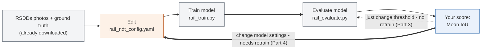

# Lab 2: Detecting Rail Defects with AI

No programming experience required. You will follow copy-paste steps in a
terminal and edit one plain-text settings file. That's it — the AI code
itself is already written for you.

## What you'll learn

- What "Non-Destructive Testing" (NDT) means and why AI can help with it
- What it means for AI to "segment" an image (draw where something is,
  pixel by pixel) instead of just labeling the whole photo
- How a single setting — the **decision threshold** — controls the
  trade-off between catching every defect and avoiding false alarms
- How to read an accuracy score (IoU) and compare it with classmates

## The big picture

Railway maintenance crews inspect rail surfaces for defects (cracks,
spalling, corrosion) that could cause problems if left unnoticed —
traditionally by a human walking the track and looking. NDT means checking
for defects without damaging the rail (e.g. just photographing it), which is
exactly what our dataset does.

Unlike Lab 1, **nobody needs to label anything here** — the dataset already
comes with 113 real rail photos, each with a hand-drawn "ground truth" map
showing exactly where the defect is (drawn by the researchers who published
this dataset). Your job is to train an AI that draws its own version of that
map on a new photo, and to make that AI as accurate as possible.

## What's already done for you

- The dataset (113 photos + their official defect maps) has already been
  downloaded into `datasets/raw/rail_ndt/rsdds/`.
- All the AI code — feature extraction, model training, scoring, plotting —
  is already written in `scripts/`. You will only *run* it, never edit it.
- The only file you'll edit is `configs/rail_ndt_config.yaml`, a plain-text
  settings file (not code).

## How it all fits together



Gray = already done for you, orange = you do this, blue = your score. Two
different loops back into the same pipeline: the dotted one is fast (just
re-run evaluate); the thick one requires starting again from training.

## Part 0: One-time setup

Open a terminal (on Mac: the **Terminal** app; on Windows: **Anaconda
Prompt** or **PowerShell**) and run these commands one at a time:

```bash
cd AI-training
python3 -m venv .venv
source .venv/bin/activate      # Windows: .venv\Scripts\activate
pip install -r requirements.txt
```

If you already did this for Lab 1 in the same folder, you can skip straight
to Part 1 (just remember to run the `source .venv/bin/activate` line again
in any new terminal window).

## Part 1: Train your model

Open `configs/rail_ndt_config.yaml` in any plain-text editor (Notepad,
TextEdit, VS Code — anything that isn't Word). You'll see settings like:

```yaml
model_type: random_forest
n_estimators: 100
max_depth: 8
random_seed: 42
threshold: 0.5
```

For now, leave everything as-is and run:

```bash
python3 scripts/rail_train.py
```

This looks at every pixel of the training photos and learns what a "defect
pixel" tends to look like (its brightness, texture, and where in the photo
it is), compared to normal rail surface. It takes under a minute.

## Part 2: Evaluate your model

```bash
python3 scripts/rail_evaluate.py
```

This tests your model on photos it never trained on, and prints something
like:

```
Mean IoU:  0.25 (higher is better, 1.0 = perfect)
Mean Dice: 0.38 (higher is better, 1.0 = perfect)
```

**IoU (Intersection over Union)** measures how much your model's guessed
defect area overlaps with the real defect area. 1.0 = perfect overlap, 0 =
no overlap at all. This is your score — **higher is better**.

It also saves a picture, `results/figures/rail_eval.png`, showing several
test photos side by side: the original photo, the real defect map, and your
model's guessed defect map. Look at it — this is the most useful way to
understand what your model is actually doing.

## Part 3: Tune the threshold (this is the main "no retraining needed" lever)

Your model doesn't just say "defect" or "not defect" for each pixel — it
gives a confidence score from 0 to 1. The `threshold` setting decides how
confident it must be before marking a pixel as a defect:

| threshold | Effect |
|---|---|
| Low (e.g. 0.2) | Flags more pixels — catches more real defects, but also more false alarms |
| High (e.g. 0.8) | Flags fewer pixels — fewer false alarms, but risks missing real defects |

Open `configs/rail_ndt_config.yaml`, change only the `threshold` value, and
re-run **just** the evaluate step (no need to retrain):

```bash
python3 scripts/rail_evaluate.py
```

Try several values (e.g. 0.3, 0.4, 0.5, 0.6, 0.7, 0.8) and note the Mean IoU
each time. This is the fastest way to improve your score, and needs no
retraining — each check takes only a few seconds.

## Part 4: (Optional/stretch) Retrain with different settings

If you want to go further, edit `model_type`, `n_estimators`, `max_depth`, or
`random_seed`, then re-run **both** steps in order (these settings only take
effect after retraining):

```bash
python3 scripts/rail_train.py
python3 scripts/rail_evaluate.py
```

Then repeat Part 3 to re-tune the threshold for your new model — the best
threshold can be different for different settings.

## Compete with classmates

Keep a scoreboard:

| Your name | model_type | key settings | threshold | Mean IoU (higher = better) |
|---|---|---|---|---|
|   |   |   |   |   |

## Glossary

- **NDT (Non-Destructive Testing)** — inspecting something for defects
  without damaging it, e.g. from a photo instead of cutting the rail open.
- **Segmentation** — instead of labeling a whole photo ("defective" or
  not), the model marks *which pixels* belong to the defect.
- **Ground truth** — the correct answer, here a hand-drawn map of exactly
  where each defect is, made by the dataset's original researchers.
- **Threshold** — the confidence cutoff (0 to 1) above which a pixel is
  called "defect." The only setting you can change without retraining.
- **IoU (Intersection over Union)** — overlap between your model's guessed
  defect area and the real one, divided by their combined area. 1.0 =
  identical, 0 = no overlap.
- **Dice score** — a very similar overlap measure to IoU; usually a bit
  higher for the same prediction. Both are reported so you can compare.
- **False positive** — a normal pixel wrongly marked as a defect (a false
  alarm).
- **False negative** — a real defect pixel the model missed.
- **Class imbalance** — in every photo, the vast majority of pixels are
  normal rail and only a small area is defect. The model is specifically
  built to account for this (search "balanced" if you're curious), otherwise
  it could get a deceptively high score just by never predicting "defect" at
  all.
- **Random Forest** — a model made of many simple decision-making "trees"
  that vote on each pixel; `n_estimators` = number of trees, `max_depth` =
  how detailed each tree's questions can get.

## Troubleshooting

- **"no RSDDs images found"** — run `python3 scripts/fetch_rsdds.py` first
  to download the dataset (only needs to be done once).
- **"no trained model found"** — run `python3 scripts/rail_train.py` before
  `rail_evaluate.py`.
- **Changed a setting but the score didn't change** — only `threshold`
  takes effect immediately; every other setting requires re-running
  `rail_train.py` first.
- **Score looks much worse than a classmate's with identical settings** —
  double check `random_seed` is the same; it controls which photos land in
  the training vs. test group, so a different seed is training/testing on a
  different split of photos entirely.

## Something to think about (discuss with the class)

- Why is a high IoU score harder to achieve here than a high accuracy score
  would be, given how small the defect areas are compared to the whole
  photo?
- In a real inspection system, would you rather have a lower threshold (more
  false alarms) or a higher one (more missed defects)? Does your answer
  change if a missed crack could cause a derailment?
- This dataset has no "clean rail" photos without any defect at all — every
  image contains one. How might that affect what the model has learned,
  and what would you want to add to fix it?
