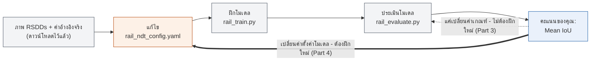

# บทปฏิบัติการที่ 2: ตรวจจับข้อบกพร่องของรางรถไฟด้วย AI

ไม่ต้องมีพื้นฐานการเขียนโปรแกรม คุณจะทำตามขั้นตอนแบบคัดลอก-วางในเทอร์มินัลและแก้ไขไฟล์
ตั้งค่าแบบข้อความล้วนเพียงไฟล์เดียว เท่านั้นเอง — โค้ด AI ทั้งหมดมีคนเขียนไว้ให้เรียบร้อยแล้ว

## สิ่งที่คุณจะได้เรียนรู้

- ความหมายของ "Non-Destructive Testing" (NDT หรือการทดสอบแบบไม่ทำลาย) และเหตุใด AI
  จึงช่วยได้
- ความหมายของการ "แบ่งส่วนภาพ" (segmentation) ด้วย AI (การระบุตำแหน่งทีละพิกเซล)
  แทนที่จะติดป้ายกำกับทั้งภาพ
- ค่าตั้งค่าเพียงค่าเดียว — **ค่าเกณฑ์การตัดสินใจ (decision threshold)** — ควบคุมจุดสมดุล
  ระหว่างการตรวจจับข้อบกพร่องให้ได้ทุกจุดกับการหลีกเลี่ยงการแจ้งเตือนผิดพลาดได้อย่างไร
- วิธีอ่านค่าความแม่นยำ (IoU) และเปรียบเทียบกับเพื่อนร่วมชั้น

## ภาพรวมของงาน

ทีมซ่อมบำรุงทางรถไฟตรวจสอบพื้นผิวรางเพื่อหาข้อบกพร่อง (รอยแตกร้าว, การกะเทาะของผิวราง,
สนิม) ที่อาจก่อให้เกิดปัญหาหากไม่ถูกตรวจพบ — โดยดั้งเดิมทำโดยเจ้าหน้าที่เดินตรวจตามรางแล้วดู
ด้วยตา NDT หมายถึงการตรวจสอบหาข้อบกพร่องโดยไม่ทำลายราง (เช่น แค่ถ่ายภาพเท่านั้น)
ซึ่งตรงกับสิ่งที่ชุดข้อมูลของเราทำอยู่พอดี

ต่างจากบทปฏิบัติการที่ 1 **ไม่มีใครต้องติดป้ายกำกับอะไรในบทนี้เลย** — ชุดข้อมูลมาพร้อมภาพราง
รถไฟจริง 113 ภาพอยู่แล้ว แต่ละภาพมีแผนที่ "ค่าอ้างอิงจริง" (ground truth) ที่วาดด้วยมือ แสดง
ตำแหน่งของข้อบกพร่องอย่างชัดเจน (วาดโดยนักวิจัยผู้เผยแพร่ชุดข้อมูลนี้) งานของคุณคือฝึก AI ให้วาด
แผนที่แบบเดียวกันด้วยตัวเองบนภาพใหม่ และทำให้ AI นั้นแม่นยำที่สุดเท่าที่จะทำได้

## สิ่งที่เตรียมไว้ให้คุณแล้ว

- ชุดข้อมูล (ภาพ 113 ภาพ + แผนที่ข้อบกพร่องอย่างเป็นทางการ) ถูกดาวน์โหลดไว้ใน
  `datasets/raw/rail_ndt/rsdds/` แล้ว
- โค้ด AI ทั้งหมด — การสกัดฟีเจอร์, การฝึกโมเดล, การให้คะแนน, การพล็อตกราฟ — ถูกเขียนไว้แล้ว
  ใน `scripts/` คุณมีหน้าที่แค่ *รัน* เท่านั้น ไม่ต้องแก้ไข
- ไฟล์เดียวที่คุณจะแก้ไขคือ `configs/rail_ndt_config.yaml` ซึ่งเป็นไฟล์ตั้งค่าแบบข้อความล้วน
  (ไม่ใช่โค้ด)

## ภาพรวมขั้นตอนการทำงานทั้งหมด



สีเทา = ทำไว้ให้คุณแล้ว, สีส้ม = ขั้นตอนที่คุณต้องทำเอง, สีน้ำเงิน = คะแนนของคุณ มีลูปย้อนกลับ
สองแบบเข้าสู่ขั้นตอนเดิม: เส้นประคือทางลัดที่รวดเร็ว (แค่รันขั้นตอนประเมินใหม่); เส้นหนาต้องเริ่ม
ใหม่ตั้งแต่การฝึกโมเดล

## Part 0: ตั้งค่าเริ่มต้น (ทำครั้งเดียว)

เปิดเทอร์มินัล (บน Mac: แอป **Terminal**; บน Windows: **Anaconda Prompt** หรือ
**PowerShell**) แล้วรันคำสั่งต่อไปนี้ทีละบรรทัด:

```bash
cd AI-training
python3 -m venv .venv
source .venv/bin/activate      # Windows: .venv\Scripts\activate
pip install -r requirements.txt
```

หากคุณทำขั้นตอนนี้ไว้แล้วสำหรับบทปฏิบัติการที่ 1 ในโฟลเดอร์เดียวกัน คุณข้ามไปทำ Part 1 ได้เลย
(แค่อย่าลืมรันบรรทัด `source .venv/bin/activate` ใหม่ทุกครั้งที่เปิดหน้าต่างเทอร์มินัลใหม่)

## Part 1: ฝึกโมเดลของคุณ

เปิดไฟล์ `configs/rail_ndt_config.yaml` ด้วยโปรแกรมแก้ไขข้อความล้วนใด ๆ (Notepad, TextEdit,
VS Code — อะไรก็ได้ที่ไม่ใช่ Word) คุณจะเห็นค่าตั้งค่าแบบนี้:

```yaml
model_type: random_forest
n_estimators: 100
max_depth: 8
random_seed: 42
threshold: 0.5
```

สำหรับตอนนี้ ให้คงค่าทุกอย่างไว้เหมือนเดิมแล้วรัน:

```bash
python3 scripts/rail_train.py
```

คำสั่งนี้จะพิจารณาทุกพิกเซลของภาพฝึกและเรียนรู้ว่า "พิกเซลที่เป็นข้อบกพร่อง" มีลักษณะอย่างไร
(ความสว่าง, ลวดลายพื้นผิว, และตำแหน่งในภาพ) เทียบกับพื้นผิวรางปกติ ใช้เวลาไม่ถึงหนึ่งนาที

## Part 2: ประเมินโมเดลของคุณ

```bash
python3 scripts/rail_evaluate.py
```

คำสั่งนี้จะทดสอบโมเดลของคุณกับภาพที่ไม่เคยใช้ฝึกมาก่อน แล้วแสดงผลลัพธ์ประมาณนี้:

```
Mean IoU:  0.25 (higher is better, 1.0 = perfect)
Mean Dice: 0.38 (higher is better, 1.0 = perfect)
```

**IoU (Intersection over Union)** วัดว่าพื้นที่ข้อบกพร่องที่โมเดลของคุณทายซ้อนทับกับพื้นที่
ข้อบกพร่องจริงมากแค่ไหน 1.0 = ซ้อนทับกันสมบูรณ์, 0 = ไม่ซ้อนทับกันเลย นี่คือคะแนนของคุณ —
**ยิ่งสูงยิ่งดี**

นอกจากนี้ยังบันทึกภาพสองภาพไว้ด้วย:

- `results/figures/rail_eval.png` — ภาพทดสอบหลายภาพเรียงกัน แต่ละภาพแสดงพื้นที่ข้อบกพร่องจริง
  และที่ทายซ้อนทับลงบนภาพรางรถไฟจริงด้วยสี — **สีเหลือง** = ตรวจจับถูกต้อง, **สีเขียว** =
  ข้อบกพร่องจริงที่โมเดลพลาดไป, **สีแดง** = การแจ้งเตือนผิดพลาด — พร้อมค่า IoU ของภาพนั้นกำกับ
  ไว้ด้านบน ลองดูภาพนี้ — เป็นวิธีที่มีประโยชน์ที่สุดในการทำความเข้าใจว่าโมเดลของคุณกำลังทำอะไรอยู่
- `results/figures/rail_eval_threshold_curve.png` — ค่า Mean IoU และ Mean Dice ที่คำนวณ
  อัตโนมัติทุกค่าเกณฑ์ตั้งแต่ 0.05 ถึง 0.95 สำหรับโมเดลที่ฝึกไว้ตัวเดียวกันนี้ พร้อมทำเครื่องหมาย
  ค่าเกณฑ์ปัจจุบันของคุณไว้ เป็นตัวอย่างล่วงหน้าของจุดสมดุลที่คุณจะลองปรับด้วยตัวเองใน Part 3

## Part 3: ปรับค่าเกณฑ์ (เครื่องมือหลักที่ "ไม่ต้องฝึกโมเดลใหม่")

โมเดลของคุณไม่ได้แค่บอกว่า "เป็นข้อบกพร่อง" หรือ "ไม่ใช่" สำหรับแต่ละพิกเซล แต่ให้คะแนนความ
มั่นใจตั้งแต่ 0 ถึง 1 ค่าตั้งค่า `threshold` (ค่าเกณฑ์) เป็นตัวกำหนดว่าโมเดลต้องมั่นใจแค่ไหนก่อน
จะทำเครื่องหมายพิกเซลนั้นว่าเป็นข้อบกพร่อง:

| threshold (ค่าเกณฑ์) | ผลลัพธ์ |
|---|---|
| ต่ำ (เช่น 0.2) | ทำเครื่องหมายพิกเซลมากขึ้น — จับข้อบกพร่องจริงได้มากขึ้น แต่ก็แจ้งเตือนผิดพลาดมากขึ้นด้วย |
| สูง (เช่น 0.8) | ทำเครื่องหมายพิกเซลน้อยลง — แจ้งเตือนผิดพลาดน้อยลง แต่เสี่ยงพลาดข้อบกพร่องจริง |

เปิด `configs/rail_ndt_config.yaml` เปลี่ยนเฉพาะค่า `threshold` แล้วรัน**เฉพาะ**ขั้นตอน
ประเมินใหม่ (ไม่ต้องฝึกโมเดลใหม่):

```bash
python3 scripts/rail_evaluate.py
```

ลองหลายค่า (เช่น 0.3, 0.4, 0.5, 0.6, 0.7, 0.8) แล้วจดค่า Mean IoU ที่ได้แต่ละครั้ง นี่คือวิธี
ที่เร็วที่สุดในการปรับปรุงคะแนนของคุณ และไม่ต้องฝึกโมเดลใหม่ — แต่ละครั้งใช้เวลาเพียงไม่กี่วินาที

## Part 4: (ทางเลือกเพิ่มเติม/ขั้นสูง) ฝึกโมเดลใหม่ด้วยค่าตั้งค่าอื่น

หากต้องการลองเพิ่มเติม ให้แก้ไข `model_type`, `n_estimators`, `max_depth` หรือ `random_seed`
แล้วรันทั้งสองขั้นตอนใหม่ตามลำดับ (ค่าตั้งค่าเหล่านี้จะมีผลก็ต่อเมื่อฝึกโมเดลใหม่เท่านั้น):

```bash
python3 scripts/rail_train.py
python3 scripts/rail_evaluate.py
```

จากนั้นทำ Part 3 ซ้ำเพื่อปรับค่าเกณฑ์ใหม่สำหรับโมเดลใหม่ของคุณ — ค่าเกณฑ์ที่ดีที่สุดอาจ
แตกต่างกันไปตามค่าตั้งค่าที่ต่างกัน

## แข่งกับเพื่อนร่วมชั้น

จดบันทึกคะแนนไว้:

| ชื่อของคุณ | model_type | ค่าตั้งค่าหลัก | threshold | Mean IoU (ยิ่งสูงยิ่งดี) |
|---|---|---|---|---|
|   |   |   |   |   |

## Part 5 (ทางเลือกเพิ่มเติม): สร้างรายงานที่แชร์ได้

เมื่อคุณพอใจกับผลลัพธ์ที่ได้แล้ว ให้แปลงเป็นไฟล์ PDF หน้าเดียวที่พิมพ์หรือส่งให้เพื่อนร่วมชั้น/
วิทยากรได้:

```bash
python3 scripts/rail_report.py
```

คำสั่งนี้จะอ่านผลลัพธ์ล่าสุดของคุณแล้วบันทึกเป็น `results/reports/rail_report.pdf`
— รวมค่าตั้งค่า คะแนน ตัวอย่างการทาย และกราฟค่าเกณฑ์ไว้ในหน้าเดียว รันซ้ำได้ทุกเมื่อหลัง Part 2
(หรือหลังปรับค่าเกณฑ์ใน Part 3) เพื่อบันทึกผลลัพธ์ที่ดีที่สุดของคุณในปัจจุบัน

## อภิธานศัพท์

- **NDT (Non-Destructive Testing)** — การตรวจสอบหาข้อบกพร่องโดยไม่ทำให้สิ่งของนั้นเสียหาย
  เช่น ตรวจจากภาพถ่ายแทนที่จะตัดรางออกมาดู
- **Segmentation (การแบ่งส่วนภาพ)** — แทนที่จะติดป้ายกำกับทั้งภาพว่า "มีข้อบกพร่อง" หรือไม่
  โมเดลจะทำเครื่องหมาย *พิกเซลใดบ้าง* ที่เป็นส่วนหนึ่งของข้อบกพร่อง
- **Ground truth (ค่าอ้างอิงจริง)** — คำตอบที่ถูกต้อง ในที่นี้คือแผนที่ที่วาดด้วยมือแสดงตำแหน่ง
  ของข้อบกพร่องแต่ละจุดอย่างแม่นยำ จัดทำโดยนักวิจัยเจ้าของชุดข้อมูลต้นฉบับ
- **Threshold (ค่าเกณฑ์)** — จุดตัดความมั่นใจ (0 ถึง 1) ที่เมื่อเกินค่านี้พิกเซลจะถูกเรียกว่า
  "ข้อบกพร่อง" เป็นค่าตั้งค่าเดียวที่คุณเปลี่ยนได้โดยไม่ต้องฝึกโมเดลใหม่
- **IoU (Intersection over Union)** — พื้นที่ซ้อนทับระหว่างพื้นที่ข้อบกพร่องที่โมเดลของคุณทาย
  กับพื้นที่จริง หารด้วยพื้นที่รวมของทั้งสอง 1.0 = เหมือนกันทุกประการ, 0 = ไม่ซ้อนทับกันเลย
- **Dice score** — ค่าวัดการซ้อนทับที่คล้ายกับ IoU มาก มักมีค่าสูงกว่าเล็กน้อยสำหรับการทายแบบ
  เดียวกัน ทั้งสองค่าถูกรายงานไว้เพื่อให้คุณเปรียบเทียบได้
- **False positive (ผลบวกลวง)** — พิกเซลปกติที่ถูกทำเครื่องหมายผิดว่าเป็นข้อบกพร่อง
  (การแจ้งเตือนผิดพลาด)
- **False negative (ผลลบลวง)** — พิกเซลข้อบกพร่องจริงที่โมเดลพลาดไป
- **Class imbalance (ความไม่สมดุลของคลาส)** — ในทุกภาพ พิกเซลส่วนใหญ่คือรางปกติ มีเพียงพื้นที่
  เล็ก ๆ เท่านั้นที่เป็นข้อบกพร่อง โมเดลถูกออกแบบมาโดยเฉพาะเพื่อรองรับเรื่องนี้ (ลองค้นหาคำว่า
  "balanced" หากอยากรู้เพิ่มเติม) มิฉะนั้นโมเดลอาจได้คะแนนสูงอย่างหลอกลวงเพียงเพราะไม่เคยทาย
  "ข้อบกพร่อง" เลย
- **Random Forest** — โมเดลที่ประกอบด้วย "ต้นไม้ตัดสินใจ" แบบง่าย ๆ จำนวนมากที่ออกเสียงโหวต
  แต่ละพิกเซล `n_estimators` = จำนวนต้นไม้, `max_depth` = ความละเอียดของคำถามที่แต่ละต้น
  ถามได้

## แก้ปัญหาเบื้องต้น

- **"no RSDDs images found"** — รัน `python3 scripts/fetch_rsdds.py` ก่อน เพื่อดาวน์โหลด
  ชุดข้อมูล (ทำครั้งเดียวก็พอ)
- **"no trained model found"** — รัน `python3 scripts/rail_train.py` ก่อน `rail_evaluate.py`
- **เปลี่ยนค่าตั้งค่าแล้วแต่คะแนนไม่เปลี่ยน** — มีเพียง `threshold` เท่านั้นที่มีผลทันที
  ค่าตั้งค่าอื่นทั้งหมดต้องรัน `rail_train.py` ใหม่ก่อน
- **คะแนนแย่กว่าของเพื่อนร่วมชั้นมาก ทั้งที่ใช้ค่าตั้งค่าเหมือนกันทุกประการ** — ตรวจสอบว่า
  `random_seed` เหมือนกันหรือไม่ เพราะค่านี้กำหนดว่าภาพใดจะอยู่ในกลุ่มฝึกหรือกลุ่มทดสอบ
  ค่า seed ที่ต่างกันหมายถึงการฝึก/ทดสอบด้วยชุดภาพที่แบ่งต่างกันไปเลย

## ประเด็นให้ลองคิดต่อ (พูดคุยกับเพื่อนร่วมชั้น)

- เหตุใดการทำคะแนน IoU สูงจึงยากกว่าการทำคะแนนความแม่นยำ (accuracy) สูงในกรณีนี้ เมื่อพิจารณา
  ว่าพื้นที่ข้อบกพร่องมีขนาดเล็กมากเมื่อเทียบกับภาพทั้งภาพ?
- ในระบบตรวจสอบจริง คุณอยากให้ใช้ค่าเกณฑ์ต่ำ (แจ้งเตือนผิดพลาดมากขึ้น) หรือค่าเกณฑ์สูง
  (พลาดข้อบกพร่องมากขึ้น)? คำตอบของคุณเปลี่ยนไปหรือไม่ หากรอยแตกร้าวที่พลาดไปอาจทำให้
  รถไฟตกราง?
- ชุดข้อมูลนี้ไม่มีภาพ "รางสะอาด" ที่ไม่มีข้อบกพร่องเลยแม้แต่ภาพเดียว — ทุกภาพมีข้อบกพร่อง
  อย่างน้อยหนึ่งจุด สิ่งนี้อาจส่งผลต่อสิ่งที่โมเดลเรียนรู้ไปอย่างไร และคุณอยากเพิ่มอะไรเพื่อแก้ไข
  ปัญหานี้?
